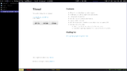
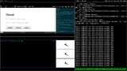

## Features

* Tiling WM, includes floating window support
* Written in pure python, simple small and extensible
* Configured with yaml files
* Includes hooks for python code if needed
* Supports multiple screens, and automatically updates screen configuration
* Includes asynchronous main loop so no widgets can block entire WM
* Includes dmenu-like gadget

## Screenshots

Tilenol with nice tabs gadget and `Max` layout:

Tilenol with a special layout to test Tilenol itself running inside Xephyr
with multiple screens:

## Mailing list

[tilenol@googlegroups.com](http://groups.google.com/group/tilenol)

